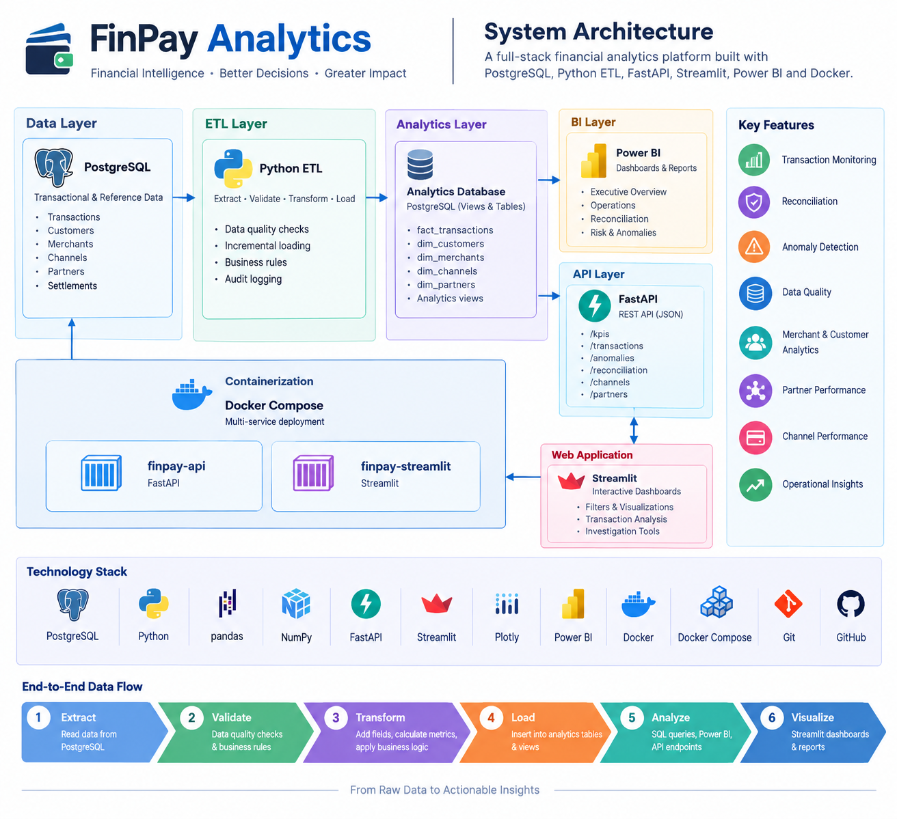

# FinPay Analytics

A full-stack financial analytics and transaction intelligence platform built to demonstrate practical skills in **SQL, PostgreSQL, Power BI, Python ETL, FastAPI, Streamlit, Docker, and GitHub**.


## Project Overview

FinPay Analytics is a simulated fintech analytics platform for monitoring transaction performance, payment channels, payment partners, reconciliation exceptions, data quality, and transaction anomalies.

The project combines a relational PostgreSQL data layer with automated Python ETL, SQL-based analytics, Power BI dashboards, a FastAPI backend, and a Streamlit application.

The goal is to demonstrate how raw financial transaction data can be transformed into reliable business intelligence and operational monitoring tools.

## System Architecture



The platform follows a layered architecture combining PostgreSQL, Python ETL, SQL analytics, Power BI, FastAPI, Streamlit, and Docker.


## Business Problem

Financial institutions and payment platforms need visibility into:

- Transaction volume and transaction value
- Successful, failed, pending, and refunded transactions
- Customer and merchant performance
- Payment channel performance
- Payment partner performance
- Settlement and reconciliation exceptions
- Data-quality problems
- Potentially anomalous transactions
- Operational trends over time

FinPay Analytics addresses these needs through a layered analytics architecture.

---

## Key Results

The current dataset contains:

- **10,000 transactions**
- Multiple payment channels
- Multiple payment partners
- Customer and merchant dimensions
- Settlement data
- Transaction-level anomaly detection
- Reconciliation analysis
- Automated data-quality validation
- Incremental ETL processing

The project also identified **1,599 transaction anomalies** through the implemented anomaly-monitoring logic.

The current reconciliation dataset contains:

- **5,672 matched transactions**
- **4,328 transactions without settlement records**

> Note: the settlement exceptions are generated from the simulated settlement dataset and are intended for demonstrating reconciliation workflows rather than representing production financial data.

---

# Architecture

```text
                         ┌──────────────────────┐
                         │      PostgreSQL      │
                         │                      │
                         │ Transactions         │
                         │ Customers            │
                         │ Merchants            │
                         │ Channels             │
                         │ Partners             │
                         │ Settlements          │
                         └──────────┬───────────┘
                                    │
                                    ▼
                         ┌──────────────────────┐
                         │     Python ETL       │
                         │                      │
                         │ Extract              │
                         │ Validate             │
                         │ Transform            │
                         │ Incremental Load     │
                         │ Audit Logging        │
                         └──────────┬───────────┘
                                    │
                     ┌──────────────┴──────────────┐
                     │                             │
                     ▼                             ▼
             ┌────────────────┐           ┌────────────────┐
             │   SQL Views    │           │  Analytics DB  │
             │                │           │                │
             │ KPIs           │           │ transactions_  │
             │ Merchant       │           │ analytics      │
             │ Customer       │           └────────────────┘
             │ Channel        │
             │ Partner        │
             │ Reconciliation │
             │ Anomalies      │
             └───────┬────────┘
                     │
           ┌─────────┴───────────┐
           │                     │
           ▼                     ▼
   ┌────────────────┐    ┌────────────────┐
   │   Power BI     │    │    FastAPI     │
   │                │    │                │
   │ Executive      │    │ /kpis          │
   │ Operations     │    │ /transactions  │
   │ Reconciliation │    │ /anomalies    │
   │ Risk           │    │ /channels      │
   └────────────────┘    │ /partners      │
                         │ /reconciliation│
                         └───────┬────────┘
                                 │
                                 ▼
                         ┌────────────────┐
                         │   Streamlit    │
                         │                │
                         │ Dashboards     │
                         │ Filters        │
                         │ Investigations │
                         └────────────────┘

                         Docker Compose
                              │
                     ┌────────┴────────┐
                     │                 │
                 FastAPI           Streamlit
